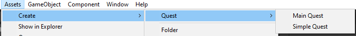
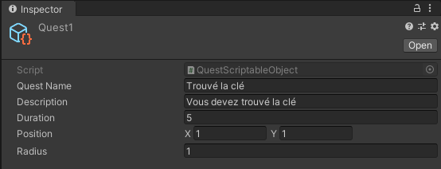
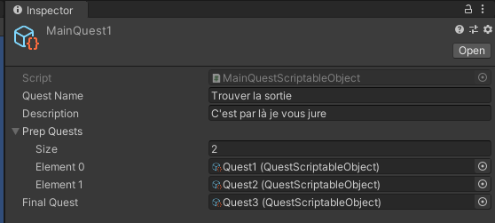

# 1 Système de quêtes

## 1.1 Les quêtes simples

Les quêtes simple sont la plus petite unité du système de quêtes, elles contiennent les paramètres suivant :

* Un nom
* Une description
* Une durée (en seconde)
* Une position (Vector2)
* Un radius

### 1.1.1 Création d'une nouvelle quête

Dans l'onglet Assets/Create/Quest/Simple Quest

## 2.1 Les quêtes principales

Les quêtes simple sont la plus petite unité du système de quêtes, elles contiennent les paramètres suivant :

* Un nom
* Une description
* Une liste de quête à faire en premier (PrepQuests)
* La dernière quête débloqué une fois toutes les PrepQuests accomplies qui conclu la partie

### 2.1.1 Création d'une nouvelle quête

Dans l'onglet Assets/Create/Quest/Main Quest

